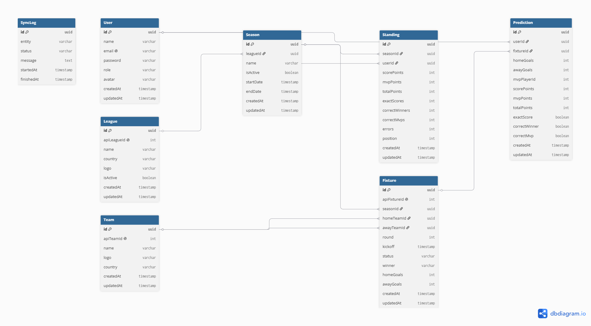

# Modelagem do Banco de Dados

## Objetivo

Este documento apresenta a modelagem do banco de dados da primeira versão do MatchPredict.

A aplicação utiliza PostgreSQL como banco de dados relacional e Prisma ORM para o mapeamento das entidades. A modelagem foi desenvolvida considerando as regras de negócio definidas para o projeto, priorizando consistência, desempenho e facilidade de evolução.

As informações esportivas são obtidas através da API-Football e sincronizadas com o banco de dados da aplicação.

---

## Tecnologias

- PostgreSQL
- Prisma ORM
- Neon Database

---

## Entidades

A versão inicial do sistema é composta pelas seguintes entidades:

- User
- League
- Season
- Team
- Fixture
- Prediction
- Standing
- SyncLog

---

## Diagrama Entidade-Relacionamento (ERD)

A imagem abaixo apresenta a estrutura completa do banco de dados, incluindo entidades, atributos e relacionamentos.

---

## Descrição das Entidades

### User

Armazena as informações dos usuários da plataforma, incluindo autenticação e permissões de acesso.

---

### League

Representa uma competição esportiva disponível na plataforma.

Exemplo:

- Premier League

A arquitetura permite adicionar novas ligas futuramente.

---

### Season

Representa uma temporada de uma determinada liga.

Exemplo:

- Premier League 2025/2026

Apenas uma temporada poderá permanecer ativa por liga.

---

### Team

Armazena os clubes participantes das competições.

As informações são sincronizadas automaticamente através da API-Football.

---

### Fixture

Representa uma partida da competição.

Contém todas as informações necessárias para realização dos palpites e cálculo da pontuação.

---

### Prediction

Representa o palpite realizado por um usuário para uma determinada partida.

Além do placar previsto, também armazena a escolha do MVP e as informações utilizadas para cálculo da pontuação.

---

### Standing

Armazena a classificação geral dos participantes em uma temporada.

Seu objetivo é facilitar consultas de ranking sem necessidade de recalcular todas as pontuações.

---

### SyncLog

Registra o histórico das sincronizações realizadas com a API-Football.

Esses registros auxiliam no monitoramento e auditoria da aplicação.

---

## Regras de Integridade

- O e-mail do usuário deve ser único.
- O identificador da liga na API deve ser único.
- O identificador do time na API deve ser único.
- O identificador da partida na API deve ser único.
- Cada usuário poderá registrar apenas um palpite por partida.
- Cada temporada pertence a uma única liga.
- Cada partida pertence a uma única temporada.
- Cada palpite pertence a um único usuário e a uma única partida.

---

## Considerações

Esta modelagem representa a estrutura da primeira versão do MatchPredict e foi desenvolvida para permitir a evolução da aplicação sem necessidade de alterações significativas na arquitetura do banco de dados.