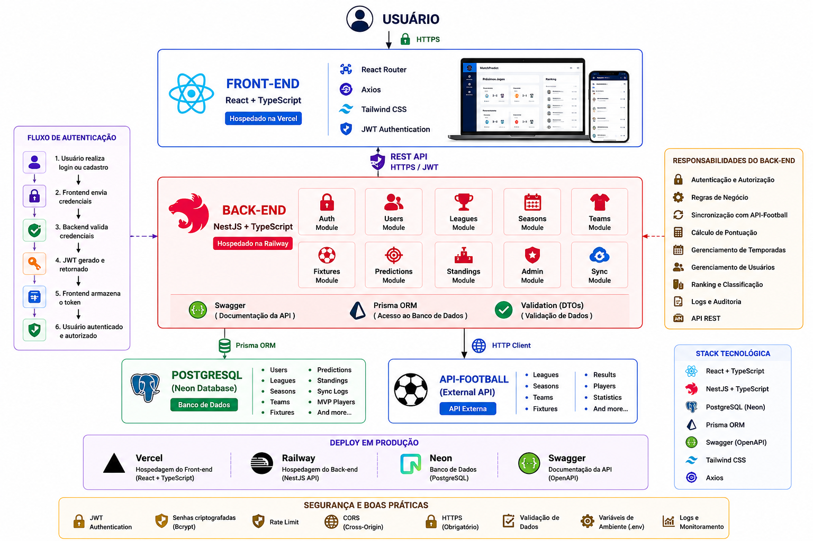

# Arquitetura da Aplicação

## Objetivo

Este documento apresenta a arquitetura da primeira versão do MatchPredict.

A aplicação foi projetada seguindo o modelo cliente-servidor, onde o Front-end é responsável pela interface com o usuário e o Back-end concentra toda a lógica de negócio, autenticação, integração com serviços externos e persistência dos dados.

A arquitetura foi planejada para ser escalável, facilitando a adição de novas competições, temporadas e funcionalidades sem a necessidade de alterações significativas na estrutura da aplicação.

---

## Visão Geral da Arquitetura

A imagem abaixo apresenta a arquitetura completa do MatchPredict.

---

## Componentes

### Front-end

Desenvolvido utilizando React e TypeScript, é responsável pela experiência do usuário e pela comunicação com a API através de requisições HTTP.

*Principais tecnologias:*

- React
- TypeScript
- React Router
- Axios
- Tailwind CSS

---

### Back-end

Desenvolvido com NestJS, concentra toda a lógica de negócio da aplicação, incluindo autenticação, gerenciamento de usuários, cálculo da pontuação, sincronização da API-Football e disponibilização da API REST.

*Principais tecnologias:*

- NestJS
- TypeScript
- Prisma ORM
- JWT
- Swagger

---

### Banco de Dados

Os dados da aplicação são armazenados em um banco PostgreSQL hospedado no Neon.

São persistidas informações como:

- Usuários
- Competições
- Temporadas
- Times
- Partidas
- Palpites
- Ranking
- Logs de sincronização

---

### API Externa

A API-Football é utilizada como fonte oficial dos dados esportivos.

Através dela são sincronizadas informações como:

- Competições
- Temporadas
- Times
- Partidas
- Resultados
- Estatísticas
- Jogadores

---

## Deploy

A arquitetura foi planejada para utilização em ambiente de produção.

| Componente | Plataforma |
|------------|------------|
| Front-end | Vercel |
| Back-end | Railway |
| Banco de Dados | PostgreSQL (Neon) |
| Documentação | Swagger |

---

## Segurança

A aplicação seguirá algumas boas práticas de segurança desde a primeira versão:

- Autenticação utilizando JWT.
- Senhas armazenadas com hash utilizando bcrypt.
- Validação de dados através de DTOs.
- Rate Limit nos endpoints de autenticação.
- Configuração de CORS.
- HTTPS obrigatório em produção.
- Utilização de variáveis de ambiente para informações sensíveis.

---

## Considerações

A arquitetura foi projetada para permitir a evolução contínua do MatchPredict. Novas ligas, temporadas e funcionalidades poderão ser adicionadas sem alterações significativas na estrutura da aplicação, tornando o sistema preparado para futuras versões.