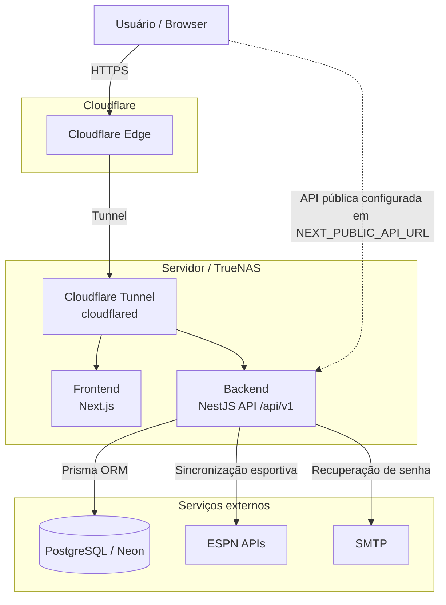

# Arquitetura da Aplicação

## Objetivo

Este documento descreve a arquitetura atual do MatchPredict.

O projeto é uma aplicação full-stack com frontend Next.js, backend NestJS, banco PostgreSQL via Prisma ORM, integração com APIs da ESPN, envio de e-mails por SMTP e deploy containerizado com Docker.

---

## Visão Geral

O MatchPredict é dividido em três partes principais:

1. Frontend web.
2. API backend.
3. Banco de dados PostgreSQL.

Além disso, a implantação atual prevista no repositório usa Cloudflare Tunnel para expor os serviços por meio de um túnel configurado fora do código.

O diagrama abaixo representa a arquitetura conceitual atual, sem expor domínio, IP, token ou credencial. Em produção, o browser acessa a API pública configurada em `NEXT_PUBLIC_API_URL`; essa URL é exposta pelo Cloudflare Tunnel, não por uma comunicação interna obrigatória entre os containers de frontend e backend.

```mermaid
flowchart TD
    browser[Usuário / Browser]

    subgraph cloudflare[Cloudflare]
        edge[Cloudflare Edge]
    end

    subgraph host[Servidor / TrueNAS]
        tunnel[Cloudflare Tunnel<br/>cloudflared]
        frontend[Frontend<br/>Next.js]
        backend[Backend<br/>NestJS API /api/v1]
    end

    subgraph external[Serviços externos]
        db[(PostgreSQL / Neon)]
        espn[ESPN APIs]
        smtp[SMTP]
    end

    browser -->|HTTPS| edge
    edge -->|Tunnel| tunnel
    tunnel --> frontend
    tunnel --> backend

    browser -.->|API pública configurada em NEXT_PUBLIC_API_URL| backend

    backend -->|Prisma ORM| db
    backend -->|Sincronização esportiva| espn
    backend -->|Recuperação de senha| smtp
```

Os principais elementos são:

- `Cloudflare Tunnel`: expõe frontend e backend sem registrar detalhes sensíveis na documentação.
- `Frontend Next.js`: entrega a interface web e usa a URL pública da API configurada em `NEXT_PUBLIC_API_URL`.
- `Backend NestJS`: concentra regras de negócio, autenticação, sincronização, processamento de palpites e integrações externas.
- `PostgreSQL / Neon`, `ESPN APIs` e `SMTP`: serviços externos consumidos pelo backend.

---

## Frontend

O frontend fica em `frontend/` e usa Next.js com App Router.

### Principais tecnologias

- Next.js 15
- React 19
- TypeScript
- Tailwind CSS
- TanStack Query
- Axios
- React Hook Form
- Zod
- Lucide React
- Sonner
- next-themes

### Responsabilidades

- Renderizar a interface pública e a área autenticada.
- Gerenciar sessão no cliente com JWT armazenado localmente.
- Consumir a API backend por HTTP.
- Exibir partidas, palpites, ranking, estatísticas e transparência.
- Permitir cadastro, login, recuperação de senha e atualização de perfil.
- Criar, editar e excluir palpites conforme as regras aplicadas pelo backend.

### Estrutura Relevante

- `frontend/src/app`: rotas do App Router.
- `frontend/src/services`: clientes HTTP por domínio.
- `frontend/src/hooks`: hooks de dados com TanStack Query.
- `frontend/src/providers`: providers globais, incluindo autenticação e tema.
- `frontend/src/features`: componentes de domínio, como partidas e palpites.
- `frontend/src/components`: componentes compartilhados e layout.

### Rotas de Interface

O frontend possui telas para:

- landing page;
- login;
- cadastro;
- recuperação de senha;
- redefinição de senha;
- dashboard;
- partidas;
- meus palpites;
- transparência;
- estatísticas;
- regras;
- perfil.

---

## Backend

O backend fica em `backend/` e usa NestJS.

### Principais tecnologias

- NestJS 11
- TypeScript
- Prisma ORM
- PostgreSQL
- JWT
- Passport JWT
- Class Validator
- Class Transformer
- Swagger
- NestJS Throttler
- NestJS Schedule
- Axios via `@nestjs/axios`
- Nodemailer

### Responsabilidades

- Expor API REST com prefixo global `/api/v1`.
- Autenticar usuários com JWT.
- Validar requisições com DTOs.
- Aplicar regras de criação, edição, exclusão e bloqueio de palpites.
- Sincronizar liga, temporada, times, partidas, jogadores e resultados a partir da ESPN.
- Processar pontuação de palpites.
- Atualizar standings.
- Fornecer ranking, estatísticas e transparência.
- Enviar e-mails de recuperação de senha via SMTP.

### Módulos principais

- `AuthModule`: cadastro, login, recuperação e redefinição de senha.
- `UsersModule`: perfil e estatísticas do usuário autenticado.
- `FootballModule`: fixtures e sincronização com ESPN.
- `PredictionsModule`: palpites, transparência, cálculo e processamento.
- `StandingsModule`: ranking e posição do usuário.
- `EmailModule`: envio de e-mails.
- `PrismaModule`: acesso ao banco.

---

## Banco de dados

O banco usado pela aplicação é PostgreSQL, acessado via Prisma ORM.

### Entidades Principais

- `User`
- `League`
- `Season`
- `Team`
- `Fixture`
- `Prediction`
- `Standing`
- `Player`
- `SyncLog`

### Observações

- A conexão é configurada por `DATABASE_URL`.
- O schema atual está em `backend/prisma/schema.prisma`.
- Migrations ficam em `backend/prisma/migrations`.
- `SyncLog` está modelado, mas não há fluxo atual gravando logs nesse modelo.
- Campos de MVP existem no schema, mas não estão ativos no fluxo atual de criação/edição de palpites.

---

## Integração com dados esportivos

A integração esportiva atual usa APIs da ESPN.

### Configurações relevantes

- `ESPN_API_URL`
- `ESPN_CORE_API_URL`
- `ESPN_LEAGUE`
- `ESPN_COUNTRY`
- `ESPN_LEAGUE_LOGO`

### Fluxos de sincronização

Administradores podem disparar:

- sincronização de liga e temporada ativa;
- sincronização de times;
- sincronização de partidas;
- sincronização de jogadores;
- sincronização de resultados.

O backend também possui um scheduler que executa a cada 5 minutos para:

1. sincronizar resultados pendentes;
2. processar fixtures finalizadas ainda não processadas.

---

## E-mail

O backend envia e-mails de recuperação de senha via SMTP.

### Configurações relevantes

- `EMAIL_PROVIDER`
- `SMTP_HOST`
- `SMTP_PORT`
- `SMTP_SECURE`
- `SMTP_USER`
- `SMTP_PASSWORD`
- `EMAIL_FROM`
- `FRONTEND_URL`

Nenhuma credencial deve ser versionada. Exemplos públicos devem usar apenas placeholders.

---

## Segurança

### Autenticação

- JWT é usado nos endpoints protegidos.
- O backend valida o usuário a partir do token em cada requisição autenticada.
- Endpoints administrativos exigem `role = ADMIN`.

### Validação

A API usa `ValidationPipe` global com:

- `whitelist: true`;
- `transform: true`;
- `forbidNonWhitelisted: true`.

### Rate Limit

Há throttling global e limites específicos em endpoints de autenticação.

### CORS e Proxy

- CORS é configurado por `CORS_ORIGINS` ou `FRONTEND_URL`.
- Em produção, uma origem CORS precisa estar configurada.
- `TRUST_PROXY_HOPS` permite configurar confiança em proxy reverso.

### Swagger

Swagger é habilitado apenas fora de produção.

---

## Deploy e Infraestrutura

O repositório possui `compose.yaml` para execução containerizada.

### Serviços

| Serviço | Container | Função |
| --- | --- | --- |
| `backend` | `matchpredict-backend` | API NestJS |
| `frontend` | `matchpredict-frontend` | Aplicação Next.js |
| `cloudflared` | `cloudflared-production` | Cloudflare Tunnel |

### Portas Locais

| Serviço | Porta no host | Porta no container |
| --- | --- | --- |
| Backend | `127.0.0.1:3001` | `3000` |
| Frontend | `3002` | `3000` |

O backend lê variáveis a partir de `backend/.env`.

O frontend recebe `NEXT_PUBLIC_API_URL` como build arg no Docker.

O serviço `cloudflared` usa `network_mode: host` e monta a pasta local `./cloudflared` como diretório de configuração do túnel. O conteúdo dessa pasta não deve expor credenciais em documentação pública.

---

## Docker

### Backend

O `backend/Dockerfile` usa build multi-stage:

1. instala dependências;
2. gera Prisma Client;
3. executa build NestJS;
4. instala dependências de produção;
5. executa `node dist/main`.

### Frontend

O `frontend/Dockerfile` usa build multi-stage:

1. instala dependências;
2. executa build Next.js;
3. copia artefatos standalone;
4. executa `node server.js`.

---

## Testes e Qualidade

### Backend

Scripts relevantes:

- `npm run lint`
- `npm test`
- `npm run test:e2e`
- `npm run build`

### Frontend

Scripts relevantes:

- `npm run lint`
- `npm run build`
- `npm run dev`
- `npm run start`

---

## Considerações

A arquitetura atual já suporta separação clara entre frontend, backend e banco, mas ainda há pontos planejados que não estão implementados:

- painel administrativo no frontend;
- CRUD manual de ligas, temporadas, times e partidas;
- endpoints públicos específicos para ligas, temporadas, times e jogadores;
- uso funcional de MVP no fluxo de palpites;
- gravação real de logs no modelo `SyncLog`.

Esta documentação descreve o estado atual do código e da infraestrutura versionada no repositório.
